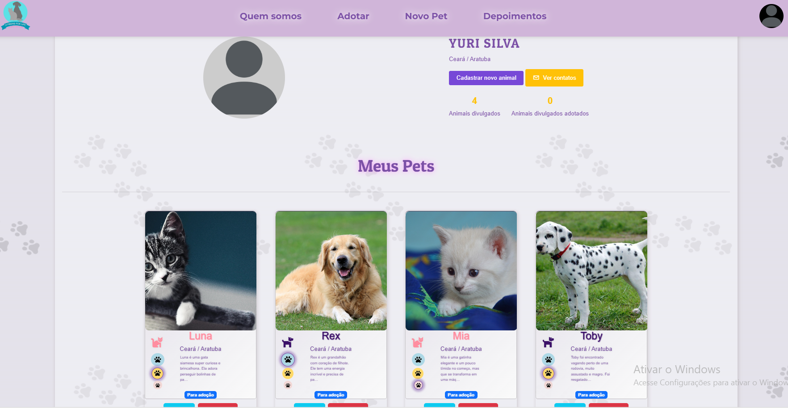
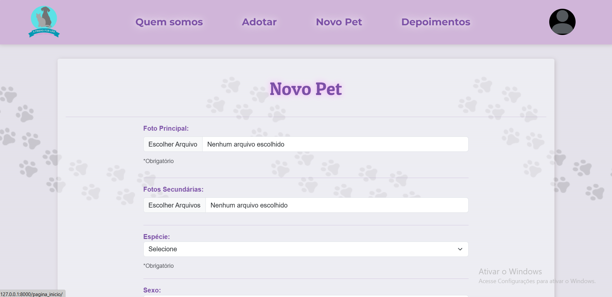
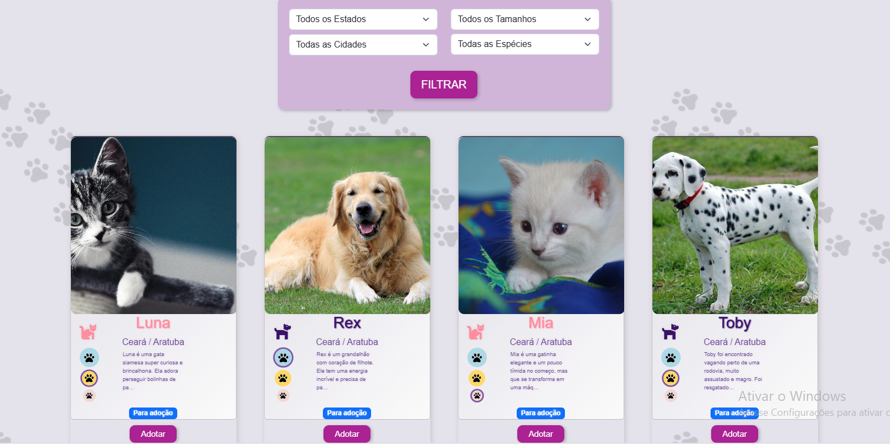
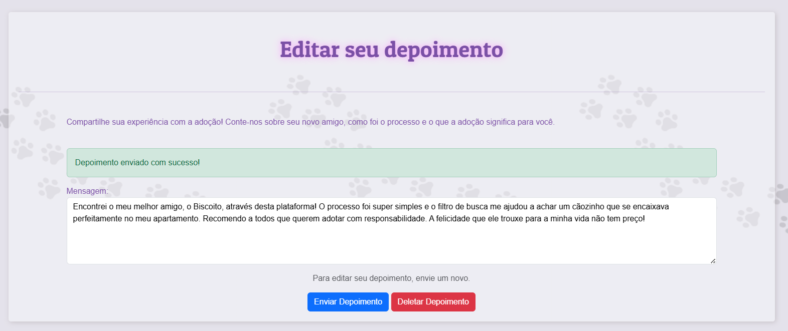
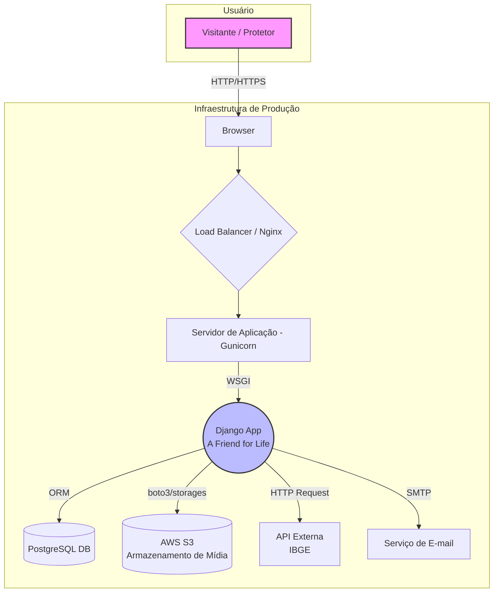

# 🐾 A Friend for Life - Plataforma de Adoção de Animais

Sistema web completo para conectar protetores de animais a pessoas interessadas em adoção, facilitando o encontro entre pets e seus futuros lares.

---

## 🚀 Acesso ao Sistema

### URL de Produção
**Acesse a aplicação em produção no seguinte link:**
### [https://um-amigo-for-life02.onrender.com/](https://um-amigo-for-life02.onrender.com/)

> **Aviso:** A aplicação está hospedada no plano gratuito do Render. Após um período de inatividade, o servidor "dorme" para economizar recursos. O **primeiro acesso pode levar de 120 a 150 segundos** para carregar enquanto o sistema "acorda". Os acessos seguintes serão instantâneos.

### Credenciais para Avaliação
Para facilitar a avaliação das funcionalidades que exigem autenticação, um usuário de teste foi pré-cadastrado no ambiente de produção.
*   **Email:** `usertest2156@gmail.com`
*   **Senha:** `User1234`

    

---

## 🎯 Problema Abordado e Objetivos

### Problema
O grande número de animais abandonados e a dificuldade de conexão entre protetores independentes/ONGs e potenciais adotantes criam um ciclo de superlotação em abrigos e sofrimento animal. Protetores lutam para dar visibilidade aos animais, enquanto pessoas que desejam adotar muitas vezes não sabem por onde começar a procurar.

### Objetivos do Sistema
*   **Centralizar e Facilitar a Adoção:** Criar um ponto de encontro digital, unificando os anúncios de pets para adoção e simplificando o processo de busca para os adotantes.
*   **Aumentar a Visibilidade:** Fornecer uma ferramenta eficaz para que protetores possam divulgar os animais sob seus cuidados para um público mais amplo.
*   **Promover a Posse Responsável:** Oferecer informações detalhadas sobre cada animal para ajudar a garantir que as adoções sejam bem-sucedidas e duradouras.
*   **Gerar Impacto Social Positivo:** Contribuir para a diminuição do número de animais abandonados e fortalecer a comunidade de proteção animal, alinhando-se ao **ODS 11 (Cidades e Comunidades Sustentáveis)**.

---

## ✨ Funcionalidades Implementadas

| Funcionalidade | Status | Screenshot |
| :--- | :--- | :--- |
| **Autenticação de Usuários:** Cadastro com confirmação via e-mail, login e recuperação de senha. | ✅ Concluído |  |
| **Gerenciamento de Perfil:** Visualização completa do perfil do usuário, com seus dados e pets cadastrados. | ✅ Concluído |  |
| **Cadastro e Gestão de Pets:** Formulário completo para cadastrar, editar e remover pets. | ✅ Concluído |  |
| **Listagem e Filtragem de Pets:** Página de adoção com filtros por localização, espécie e tamanho. | ✅ Concluído |  |
| **Sistema de Depoimentos:** Usuários autenticados podem criar, editar e remover seus depoimentos. | ✅ Concluído |  |

---

## 🚀 Início Rápido (Ambiente de Desenvolvimento)

### 1. Pré-requisitos
- Python 3.x
- Git

### 2. Configuração do Ambiente

**Passo 1: Clone o repositório**
```bash
git clone https://github.com/Yuridevpro/a-friend-for-life.git
```

**Passo 2: Entre na pasta do projeto**
```bash
cd a-friend-for-life
```

**Passo 3: Crie o ambiente virtual**
```bash
python -m venv ambiente_virtual
```

**Passo 4: Ative o ambiente virtual**

*   **No Windows:**
    ```bash
    ambiente_virtual\Scripts\activate
    ```
*   **No Linux ou macOS:**
    ```bash
    source ambiente_virtual/bin/activate
    ```

**Passo 5: Navegue até a pasta do backend**
```bash
cd backend
```

**Passo 6: Instale as dependências do projeto**
```bash
pip install -r requirements.txt
```

### 3. Variáveis de Ambiente

**Passo 7: Crie o arquivo `.env`**
Crie o arquivo `.env` na pasta `backend/` usando o comando correspondente ao seu sistema operacional.

*   **No Windows (PowerShell ou CMD):**
    ```bash
    echo SECRET_KEY=django-insecure-academic-test-key-for-local-use-only > .env
    ```
*   **No Linux ou macOS:**
    ```bash
    echo "SECRET_KEY=django-insecure-academic-test-key-for-local-use-only" > .env
    ```
*   **Nota:** Uma chave padrão foi fornecida para facilitar a execução. Para gerar sua própria chave única, execute `python -c "from django.core.management.utils import get_random_secret_key; print(get_random_secret_key())"` e cole o resultado no arquivo `.env`.


### 4. Banco de Dados e Execução
**IMPORTANTE:** A partir deste ponto, todos os comandos `manage.py` devem ser executados de dentro da pasta `backend/src/`.

**Passo 8: Navegue até a pasta do código-fonte**
```bash
cd src
```

**Passo 9: Crie o banco de dados e aplique as migrações**
```bash
python manage.py migrate
```

**Passo 10: Inicie o servidor de desenvolvimento**
```bash
python manage.py runserver
```
A aplicação estará disponível em `http://127.0.0.1:8000/`.

### 5. Ativando a Conta de Usuário Localmente
Se você não configurar um serviço de e-mail, os links de ativação serão impressos no terminal onde o `runserver` está rodando.
1.  Após se cadastrar na plataforma, verifique o console do terminal.
2.  Copie o link de confirmação (ex: `http://127.0.0.1:8000/auth/confirmar_email/...`).
3.  Cole o link no seu navegador para ativar a conta.

### 🧪 Executando os Testes
Para verificar a integridade das funcionalidades, execute a suíte de testes automatizados.

**Passo 1: Navegue até a pasta do código-fonte (se não estiver nela)**
```bash
# Se você parou o servidor, certifique-se de estar em 'backend/src/'
cd backend/src
```

**Passo 2: Execute o comando de teste**
```bash
python manage.py test ../tests
```
O resultado esperado é a execução de todos os testes com o status **OK**.

## 📦 Configuração para Produção (Deploy) OPCIONAL

Para publicar a aplicação em um serviço de hospedagem, são necessários os seguintes passos:

#### **Passo 1: Ajustes no `settings.py`**

Para que a aplicação funcione tanto localmente quanto em produção, o arquivo `backend/src/adote/settings.py` deve conter a lógica que seleciona as configurações com base na variável de ambiente `ENVIRONMENT`. Certifique-se de que as seções `DEBUG`, `ALLOWED_HOSTS` e `DATABASES` estejam como no exemplo abaixo:

```python
# backend/src/adote/settings.py

# ...
ENVIRONMENT = os.getenv('ENVIRONMENT', 'production') 
DEBUG = (ENVIRONMENT == 'development')

if DEBUG:
    ALLOWED_HOSTS = ['*']
else:
    ALLOWED_HOSTS = []
    render_hostname = os.getenv('RENDER_EXTERNAL_HOSTNAME')
    # Adicione outros hosts de produção se necessário
    if render_hostname:
        ALLOWED_HOSTS.append(render_hostname)
# ...

if DEBUG:
    DATABASES = {
        'default': {
            'ENGINE': 'django.db.backends.sqlite3',
            'NAME': SRC_DIR / 'db.sqlite3',
        }
    }
else:
    DATABASES = {
        'default': {
            'ENGINE': 'django.db.backends.postgresql',
            'NAME': os.getenv('DB_NAME'),
            'USER': os.getenv('DB_USER'),
            'PASSWORD': os.getenv('DB_PASSWORD'),
            'HOST': os.getenv('DB_HOST'),
            'PORT': os.getenv('DB_PORT', '5432'),
        }
    }
# ...
```

#### **Passo 2: Configurar Variáveis de Ambiente para Produção**

No seu serviço de hospedagem (ex: Render, Heroku), configure as seguintes variáveis de ambiente. Elas devem ser inseridas no painel de controle do serviço, não no arquivo `.env`.

```ini
# Exemplo de Variáveis de Ambiente para Produção

ENVIRONMENT=production
SECRET_KEY=sua-chave-secreta-forte-para-producao

# Chaves AWS S3 (Obrigatório)
AWS_ACCESS_KEY_ID=sua_chave_aws_de_producao
AWS_SECRET_ACCESS_KEY=sua_chave_secreta_aws_de_producao
AWS_STORAGE_BUCKET_NAME=nome-do-seu-bucket-s3
AWS_S3_REGION_NAME=us-east-1

# Chaves de E-mail (Obrigatório)
SENDGRID_API_KEY=sua-chave-api-do-sendgrid
DEFAULT_FROM_EMAIL=seu-email-verificado@exemplo.com

# Credenciais do Banco de Dados PostgreSQL (Obrigatório)
DB_NAME=nome_do_banco_postgres
DB_USER=usuario_postgres
DB_PASSWORD=senha_postgres
DB_HOST=host_do_banco_de_dados
DB_PORT=5432
```

---

## 🏛️ Arquitetura do Sistema

A plataforma utiliza uma **Arquitetura Monolítica** com o framework **Django**, seguindo o padrão **Model-View-Template (MVT)**.



## 🔬 Tecnologias Utilizadas

- **Backend:** Python, Django
- **Frontend:** HTML5, CSS3, JavaScript, Bootstrap 5, jQuery
- **Banco de Dados:** PostgreSQL (Produção), SQLite (Desenvolvimento)
- **Armazenamento:** Amazon S3
- **Infraestrutura (Produção):** Gunicorn, Nginx
- **Nota:** A estrutura de referência do projeto acadêmico inclui arquivos `package.json`, que são específicos para projetos baseados em Node.js/JavaScript. Como este projeto utiliza uma arquitetura monolítica com Django, esses arquivos não são aplicáveis.

---

## 📁 Estrutura do Projeto

```
projeto-academico/
├── .gitignore
├── README.md
│
├── backend/
│   ├── .env
│   ├── requirements.txt
│   ├── src/
│   │   ├── manage.py
│   │   ├── adote/
│   │   └── ...
│   └── tests/
│       └── ...
│
├── frontend/
│   └── web/
│       ├── public/
│       │   └── static/
│       └── src/
│           └── templates/
│               └── ...
│
├── database/
│   └── schema.sql
│
└── docs/
    └── ...
```

---

## 📄 Documentação do Projeto

Toda a documentação técnica e de planejamento do projeto está organizada na pasta `docs/` e pode ser acessada através dos links abaixo.

### Documentação de Planejamento (Etapa 1 - N705)

Esta seção contém todos os artefatos gerados durante a fase de planejamento e concepção do projeto.

#### **Artefatos de Planejamento Geral:**
-   [**Escopo, Análise de Stakeholders e Problema**](./docs/artefatos-etapa-1/01-escopo-e-stakeholders.md)
-   [**Cronograma de Desenvolvimento e MVP**](./docs/artefatos-etapa-1/02-cronograma-e-mvp.md)
-   [**Análise de Riscos e Orçamento**](./docs/artefatos-etapa-1/03-riscos-e-orcamento.md)

#### **Documentação Técnica da Etapa 1:**
-   [**Requisitos Funcionais e Não-Funcionais**](./docs/requirements/requirements.md)
-   [**Arquitetura do Sistema**](./docs/architecture/architecture.md)
-   [**Modelo de Dados (Diagrama ER)**](./docs/database/database_model.md)
-   [**Especificação de APIs e Endpoints**](./docs/api/api_specification.md)
-   [**Protótipos e Fluxos de Usuário**](./docs/prototypes/prototypes.md)

### Documentação da Implementação (Etapa 2 - N708)

Esta seção contém os artefatos gerados durante a fase de codificação e entrega do projeto final, incluindo a validação com o público-alvo.

-   [**Justificativa das Mudanças Implementadas (Etapa 1 vs. Etapa 2)**](./docs/artefatos-etapa-2/justificativa_mudancas.md)
-   [**Relatório de Validação com Público-Alvo**](./validation/validation_report.md)
-   [**Definição do Público-Alvo e Personas**](./validation/target_audience.md)
-   [**Feedback Detalhado Coletado**](./validation/feedback/feedback-coletado.md)
-   **Screenshots da Aplicação Final:** (Disponíveis na seção `Funcionalidades Implementadas` acima)

---

## 🤝 Equipe de Desenvolvimento

| Nome | Papel |
| :--- | :--- |
| José Alves Ferreira Neto | Product Owner / Gestão |
| Alan Magalhães Barros | Scrum Master |
| Alisson Rafael Silva de Almeida | Time (Desenvolvimento) |
| Yuri da Silva Ferreira | Time (Desenvolvimento) |
| Kairo César Ferreira Cunha | Time (Desenvolvimento / Testes) |
| Gabriel Nogueira Ibiapina | UX / Documentação |
```