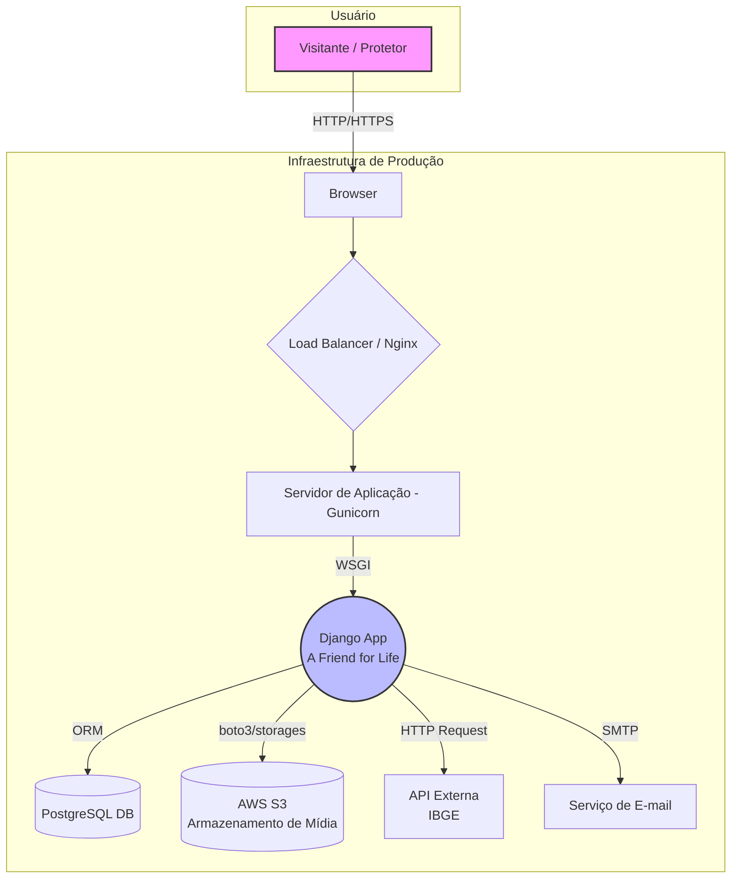

### **Arquivo: `docs/architecture/architecture.md`**

# Documento de Arquitetura do Sistema: A Friend for Life

Este documento fornece uma visão detalhada da arquitetura de software da plataforma "A Friend for Life", descrevendo seus componentes, padrões e as tecnologias utilizadas.

### 1. Visão Geral da Arquitetura

A plataforma "A Friend for Life" foi projetada utilizando uma Arquitetura Monolítica com o framework Django. Nesta abordagem, todas as funcionalidades do sistema — desde a interface do usuário até a lógica de negócios e o acesso aos dados — são desenvolvidas e implantadas como uma única unidade coesa.

Internamente, a aplicação segue o padrão arquitetural Model-View-Template (MVT), uma variação do conhecido MVC (Model-View-Controller) que é nativa do Django. Esta escolha permite uma clara separação de responsabilidades, facilitando o desenvolvimento e a manutenção do código.

O sistema interage com serviços externos para funcionalidades específicas, como o armazenamento de arquivos de mídia (AWS S3), consulta de dados geográficos (API do IBGE) e envio de e-mails (serviço SMTP), garantindo escalabilidade e desacoplamento de responsabilidades críticas.

### 2. Diagrama da Arquitetura

O diagrama a seguir ilustra a arquitetura geral do sistema, o fluxo de comunicação entre os componentes e a interação com serviços externos.



**Fluxo de Requisição:**
1. O Usuário (A) interage com a aplicação através de um Browser (B).
2. A requisição HTTP/HTTPS é recebida por um servidor web como o Nginx (C), que atua como proxy reverso e serve os arquivos estáticos.
3. O Nginx encaminha a requisição para o servidor de aplicação Gunicorn (D).
4. O Gunicorn executa a aplicação Django (E), que processa a requisição.
5. A view correspondente executa a lógica de negócios. Se necessário, ela interage com os models, que utilizam o ORM do Django para se comunicar com o banco de dados PostgreSQL (F).
6. Para upload ou recuperação de imagens, a aplicação se comunica com o AWS S3 (G).
7. Para preenchimento de dados de localização, a aplicação consulta a API do IBGE (H).
8. Para envio de e-mails de confirmação ou recuperação de senha, a aplicação utiliza um Serviço SMTP (I).
9. A view renderiza um template HTML e a resposta é enviada de volta ao usuário, seguindo o caminho inverso.

### 3. Padrões Arquiteturais Utilizados

*   **Arquitetura Monolítica:** Toda a aplicação é construída como um único projeto.
    *   **Justificativa:** Para o escopo do projeto, esta abordagem simplifica drasticamente o desenvolvimento, os testes e a implantação. Reduz a complexidade operacional, pois há apenas uma base de código e um processo de deploy a ser gerenciado, sendo ideal para equipes pequenas e para o rápido desenvolvimento do produto.
*   **Model-View-Template (MVT):** Padrão de organização de código do Django.
    *   **Model (`models.py`):** Representa a camada de dados.
    *   **View (`views.py`):** Representa a camada de lógica de negócios.
    *   **Template (`templates/`):** Representa a camada de apresentação.

### 4. Componentes do Sistema
1.  **Frontend (Camada de Apresentação):** Renderizado no servidor pelo Django (HTML5, CSS3, JS, Bootstrap 5, jQuery).
2.  **Backend (Camada de Aplicação):** Desenvolvido em Python com o framework Django.
3.  **Camada de Dados (Persistência):** Banco de Dados (PostgreSQL/SQLite) e Armazenamento de Mídia (Amazon S3).

### 5. Tecnologias e Frameworks Propostos
*   **Linguagem de Programação:** Python 3.x
*   **Framework Backend:** Django
*   **Banco de Dados:** PostgreSQL (Produção), SQLite (Desenvolvimento)
*   **Servidor de Aplicação (Produção):** Gunicorn
*   **Servidor Web (Produção):** Nginx
*   **Armazenamento de Mídia:** Amazon S3
*   **Frontend:** HTML5, CSS3, JavaScript, Bootstrap 5, jQuery
*   **Serviço de E-mail:** SMTP (via Gmail)

### 6. Decisões Técnicas e Justificativas
*   **Escolha do Django:** Framework "baterias inclusas", acelerando o desenvolvimento.
*   **Uso do PostgreSQL:** Robustez, confiabilidade e suporte a tipos de dados avançados como `JSONField`.
*   **Uso do AWS S3:** Desacopla o armazenamento de mídia, melhorando desempenho e escalabilidade.
*   **Renderização no Servidor (SSR):** Simplicidade de desenvolvimento e implantação, com vantagens de SEO.
```

---
