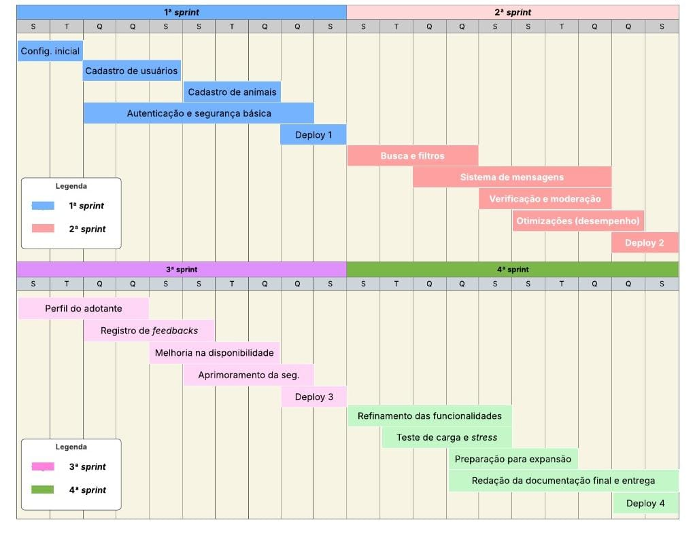

# Cronograma de Desenvolvimento e MVP (Etapa 1)

Este documento detalha o planejamento de desenvolvimento (cronograma, Sprints, MVP) e a organização da equipe, conforme definido na Etapa 1.

## 1. Visão do Produto

> Sistema capaz de, por meio de cadastro de colaboradores, conectar adotantes e protetores de animais em situação de abandono / acolhimento temporário.

## 2. Equipe e Papéis

| Nome | Função Executada (Etapa 1) |
| :--- | :--- |
| Alan Magalhães Barros | Scrum Master |
| José Alves Ferreira Neto | Product Owner |
| Alisson Rafael Silva de Almeida| Time (Desenvolvimento) |
| Yuri da Silva Ferreira | Time (Desenvolvimento) |
| Kairo César Ferreira Cunha | Time (Desenvolvimento) |
| Gabriel Nogueira Ibiapina | UX |

## 3. Cronograma de Desenvolvimento para a Etapa 2 (N708)

O projeto foi organizado em um cronograma Scrum com as seguintes diretrizes:

- **Duração Total:** 60 dias
- **Sprint (Time-box):** 2 semanas (10 dias úteis)
- **Reuniões:**
    - **Sprint Planning:** 1º dia de cada Sprint, às 19h
    - **Reuniões diárias:** 19h às 20h
    - **Sprint Review:** Último dia de cada Sprint, às 19h
    - **Sprint Retrospective:** Último dia de cada Sprint, às 20h

### Gráfico de Gantt (Planejamento Visual)

## 4. Mínimo Produto Viável (MVP) - Entregas Planejadas

O desenvolvimento foi dividido em 4 Sprints, com as seguintes entregas planejadas:

#### **1ª Sprint: Módulo básico e estrutura do sistema**
| Entrega | Detalhes |
| :--- | :--- |
| Configuração inicial do projeto | Definição do ambiente, linguagem, frameworks, setup do repositório, banco de dados, autenticação básica. |
| Cadastro de usuários | Criação de perfis para adotantes e protetores. |
| Cadastro de animais | Registro de animais com informações básicas. |
| Autenticação e segurança básica| Criptografia de senhas, login/logout. |
| Deploy inicial da aplicação | Mínimo produto viável - MVP. |

#### **2ª Sprint: Funcionalidades de interação e melhoria da experiência**
| Entrega | Detalhes |
| :--- | :--- |
| Busca e filtros | Encontrar animais para adoção com base em critérios. |
| Otimizações de desempenho | Suporte a múltiplos acessos simultâneos. |
| Deploy incremental da aplicação| Mínimo produto viável - MVP. |

#### **3ª Sprint: Expansão da plataforma e melhorias na segurança**
| Entrega | Detalhes |
| :--- | :--- |
| Mapeamento de ONGs e abrigos| Localização e cadastro de instituições. |
| Registro de feedbacks | Avaliações sobre adoções e interações. |
| Melhoria na disponibilidade | Otimização para garantir 99% de uptime. |
| Aprimoramento da segurança | Camadas extras de proteção e auditoria. |
| Deploy incremental da aplicação| Mínimo produto viável - MVP. |

#### **4ª Sprint: Testes, ajustes finais e escalabilidade**
| Entrega | Detalhes |
| :--- | :--- |
| Refinamento de funcionalidades| Correção de bugs, melhorias de usabilidade. |
| Testes de carga e stress | Garantir performance com múltiplos acessos simultâneos. |
| Preparação para expansão | Garantir que o sistema possa ser replicado em outras cidades. |
| Documentação final e entrega | Finalização do artefato de software como produto completo. |
| Deploy final da aplicação | Entrega da versão final e testagem piloto. |