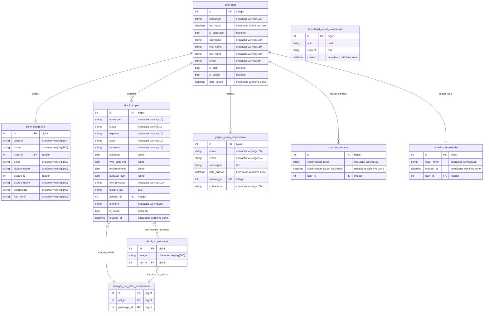

### **Arquivo: `docs/database/database_model.md`**

# Documento de Modelagem de Dados: A Friend for Life 

Este documento detalha o modelo de dados da plataforma, incluindo a descrição das entidades, seus relacionamentos, um diagrama Entidade-Relacionamento (ER) e um dicionário de dados completo e preciso.

### 1. Descrição das Entidades e Relacionamentos 
A análise do banco de dados revela as seguintes entidades e seus relacionamentos:
*   **`auth_user`:** Tabela central do Django para autenticação.
*   **`perfil_userprofile`:** Armazena dados estendidos dos usuários (Relacionamento: One-to-One com `auth_user`).
*   **`divulgar_pet`:** Entidade principal que representa os animais para adoção (Relacionamento: Many-to-One com `auth_user`).
*   **`divulgar_petimage`:** Armazena as imagens secundárias dos pets (Relacionamento: Many-to-One com `divulgar_pet`).
*   **`divulgar_pet_fotos_secundarias`:** Tabela de junção que implementa a relação Many-to-Many entre `divulgar_pet` e `divulgar_petimage`.
*   **`pagina_inicio_depoimento`:** Armazena os depoimentos dos usuários (Relacionamento: Many-to-One com `auth_user`).
*   **`usuarios_ativacao`:** Armazena tokens temporários para ativação de novas contas (Relacionamento: Many-to-One com `auth_user`).
*   **`usuarios_resetsenha`:** Armazena tokens temporários para redefinição de senha (Relacionamento: One-to-One com `auth_user`).
*   **`templated_email_savedemail`:** Tabela para registrar e arquivar os e-mails enviados pelo sistema.

### 2. Diagrama Entidade-Relacionamento (ER)

O diagrama abaixo representa visualmente as entidades e seus relacionamentos, conforme a estrutura física do banco de dados.



### 3. Dicionário de Dados (Final e Detalhado)

**Tabela: `public.auth_user`**
| Campo | Tipo de Dado | Descrição |
| :--- | :--- | :--- |
| `id` | integer | Chave Primária |
| `password` | character varying(128) | Senha do usuário (hashed) |
| `last_login` | timestamp with time zone | Data e hora do último login |
| `is_superuser` | boolean | Status de superusuário |
| `username` | character varying(150) | Nome de usuário (neste caso, o e-mail) |
| `email` | character varying(254) | Endereço de e-mail |
| `is_staff` | boolean | Status de membro da equipe (acesso ao admin) |
| `is_active` | boolean | Status de ativação da conta |
| `date_joined` | timestamp with time zone | Data de criação da conta |

**Tabela: `public.perfil_userprofile`**
| Campo | Tipo de Dado | Descrição |
| :--- | :--- | :--- |
| `id` | bigint | Chave Primária |
| `telefone` | character varying(15) | Telefone do usuário |
| `nome` | character varying(100) | Primeiro nome do usuário |
| `user_id` | integer | Chave Estrangeira para `auth_user` |
| `email` | character varying(100) | E-mail de contato |
| `cidade_nome` | character varying(100) | Nome da cidade |
| `estado_id` | integer | ID do estado (IBGE) |
| `estado_nome` | character varying(100) | Nome do estado |
| `sobrenome` | character varying(100) | Sobrenome do usuário |
| `foto_perfil` | character varying(100) | Caminho para a foto de perfil no S3 |

**Tabela: `public.divulgar_pet`**
| Campo | Tipo de Dado | Descrição |
| :--- | :--- | :--- |
| `id` | bigint | Chave Primária |
| `nome_pet` | character varying(10) | Nome do animal |
| `status` | character varying(1) | Status de adoção ('P' ou 'A') |
| `especie` | character varying(10) | Espécie do animal |
| `sexo` | character varying(10) | Sexo do animal |
| `tamanho` | character varying(10) | Porte do animal |
| `cuidados` | jsonb | Lista de cuidados veterinários |
| `vive_bem_em` | jsonb | Lista de ambientes adequados |
| `temperamento` | jsonb | Lista de traços de temperamento |
| `sociavel_com` | jsonb | Lista de com quem o pet é sociável |
| `foto_principal`| character varying(100) | Caminho para a imagem principal no S3 |
| `historia_pet` | text | História do animal |
| `usuario_id` | integer | Chave Estrangeira para `auth_user` |
| `telefone` | character varying(20) | Telefone de contato para o pet |
| `is_active` | boolean | Se o anúncio está ativo |
| `created_at` | timestamp with time zone | Data de criação do anúncio |

**Tabela: `public.divulgar_petimage`**
| Campo | Tipo de Dado | Descrição |
| :--- | :--- | :--- |
| `id` | bigint | Chave Primária |
| `image` | character varying(100) | Caminho para a imagem secundária no S3 |
| `pet_id` | bigint | Chave Estrangeira para `divulgar_pet` |

**Tabela: `public.divulgar_pet_fotos_secundarias`**
| Campo | Tipo de Dado | Descrição |
| :--- | :--- | :--- |
| `id` | bigint | Chave Primária |
| `pet_id` | bigint | Chave Estrangeira para `divulgar_pet` |
| `petimage_id` | bigint | Chave Estrangeira para `divulgar_petimage` |

**Tabela: `public.pagina_inicio_depoimento`**
| Campo | Tipo de Dado | Descrição |
| :--- | :--- | :--- |
| `id` | bigint | Chave Primária |
| `nome` | character varying(100) | Nome do autor do depoimento |
| `email` | character varying(254) | E-mail do autor |
| `mensagem` | text | Conteúdo do depoimento |
| `data_criacao`| timestamp with time zone | Data de criação do depoimento |
| `usuario_id` | integer | Chave Estrangeira para `auth_user` |
| `sobrenome` | character varying(100) | Sobrenome do autor |

**Tabela: `public.usuarios_ativacao`**
| Campo | Tipo de Dado | Descrição |
| :--- | :--- | :--- |
| `id` | bigint | Chave Primária |
| `confirmation_token` | character varying(32) | Token para ativação de conta |
| `confirmation_token_expiration` | timestamp with time zone | Data de expiração do token |
| `user_id` | integer | Chave Estrangeira para `auth_user` |

**Tabela: `public.usuarios_resetsenha`**
| Campo | Tipo de Dado | Descrição |
| :--- | :--- | :--- |
| `id` | bigint | Chave Primária |
| `reset_token` | character varying(255) | Token para redefinição de senha |
| `created_at` | timestamp with time zone | Data de criação do token |
| `user_id` | integer | Chave Estrangeira para `auth_user` |

**Tabela: `public.templated_email_savedemail`**
| Campo | Tipo de Dado | Descrição |
| :--- | :--- | :--- |
| `id` | bigint | Chave Primária |
| `uuid` | uuid | Identificador universal único |
| `content` | text | Conteúdo do e-mail arquivado |
| `created` | timestamp with time zone | Data de arquivamento do e-mail |
```

