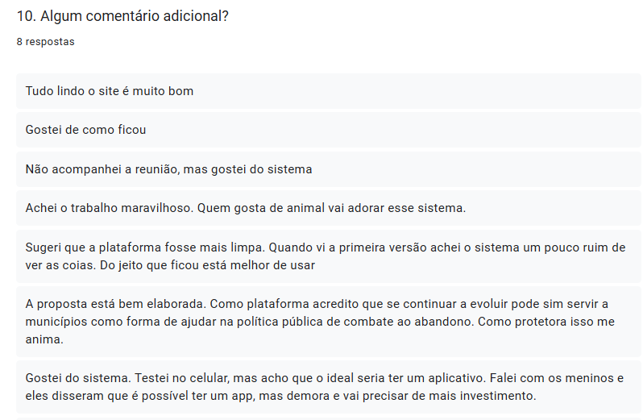

# Feedback Coletado

Este arquivo centraliza os principais feedbacks qualitativos recebidos durante a reunião de apresentação e através do formulário online.

## 1. Comentários Verbais (Durante a Reunião)

- **Sylvia Andréa (Key User - Protetora):**
  - **Sugestão:** *“É possível ao ver o animal com suas informações, ter outros sendo sugeridos de acordo com o que estou vendo?”*
    - **Análise:** Desejo por um sistema de recomendação para melhorar a descoberta de pets.

- **Protetora:**
  - **Crítica:** *“Acredito que quem tem muitos animais disponíveis, pode cansar ao preencher tantos dados.”*
    - **Análise:** Preocupação com a eficiência do formulário de cadastro de pets para usuários com alto volume.

- **Participante:**
  - **Sugestão:** *“Vocês já pensaram em permitir que as pessoas deixem avaliações com estrelas ou curtidas, como em outras plataformas, para complementar os depoimentos?”*
    - **Análise:** Ideia para aumentar o engajamento e a prova social com métricas quantitativas.

## 2. Comentários Adicionais (Do Formulário)

Abaixo estão os comentários abertos recebidos através do formulário de feedback:

- **Pontos Positivos Notáveis:**
  - "Tudo lindo o site é muito bom"
  - "Achei o trabalho maravilhoso. Quem gosta de animal vai adorar esse sistema."
  - "A proposta está bem elaborada. Como plataforma acredito que se continuar a evoluir pode sim servir a municípios..."

- **Sugestões e Críticas Construtivas:**
  - "Sugeri que a plataforma fosse mais limpa. Quando vi a primeira versão achei o sistema um pouco ruim de ver as coisas. Do jeito que ficou está melhor de usar" (Valida a melhoria do design).
  - "Gostei do sistema. Testei no celular, mas acho que o ideal seria ter um aplicativo." (Indica interesse em uma versão mobile nativa no futuro).