# Relatório Detalhado de Validação com Público-Alvo

Este documento relata o processo de contato, apresentação e validação da plataforma "A Friend for Life" com o público-alvo, conforme os requisitos da disciplina.

## 1. Contato e Apresentação do Projeto

*   **Data da Apresentação:** 04 de novembro de 2025.
*   **Formato:** Reunião online via Google Meet.

**Resumo da Apresentação:**
A equipe apresentou a plataforma "A Friend for Life" para um grupo de potenciais usuários (protetores e adotantes). Foi demonstrado o fluxo completo do sistema, desde o cadastro e login até a criação de um anúncio de pet e a visualização dos detalhes para adoção. O objetivo foi apresentar a versão funcional do projeto, destacando a nova identidade visual e as funcionalidades implementadas com base no planejamento da Etapa 1.

As evidências fotográficas desta apresentação estão documentadas abaixo.

### Evidências da Apresentação

**Telas de Login e Cadastro:**
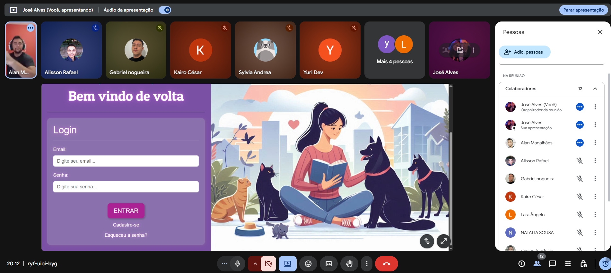
*Apresentação da tela de login.*

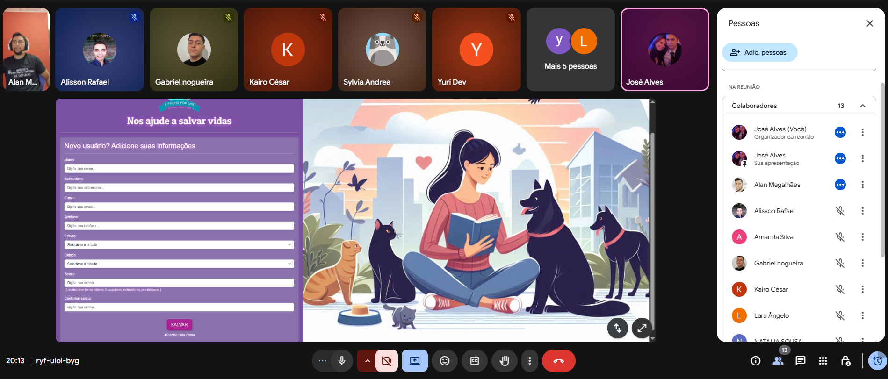
*Apresentação do formulário de cadastro de usuário.*

**Telas de Navegação Principal:**
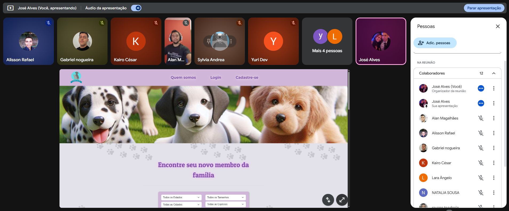
*Demonstração da página inicial após o login.*

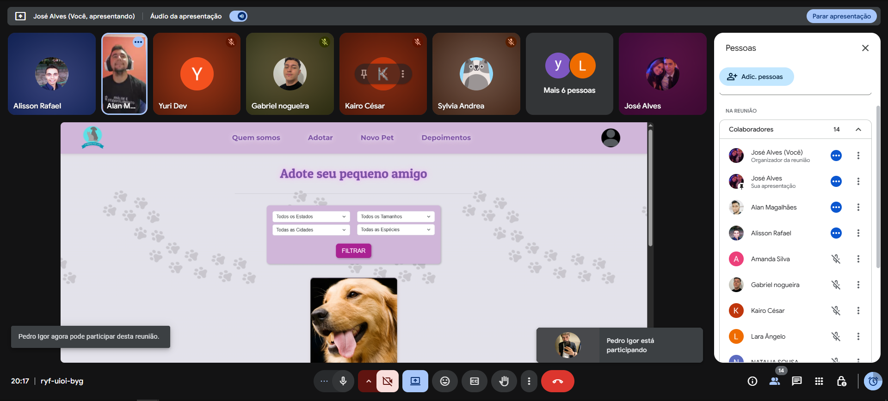
*Demonstração da página de listagem e filtro de pets.*

**Telas de Detalhes do Pet:**
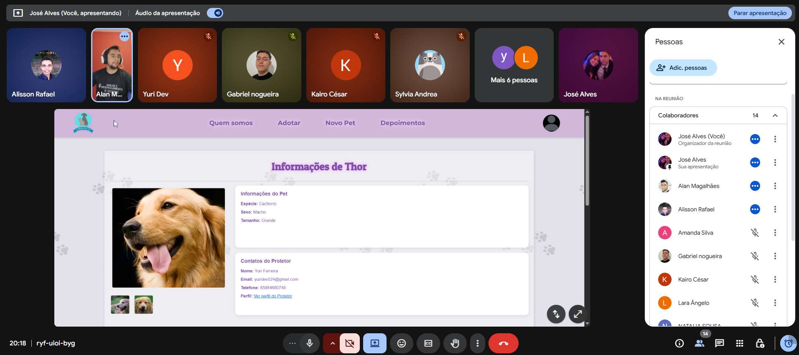
*Visualização das informações principais do animal e do protetor.*

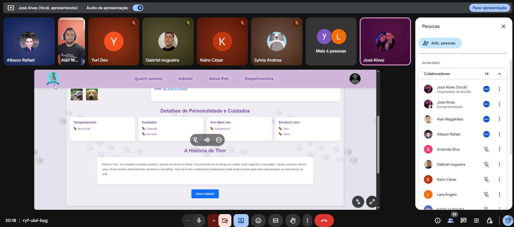
*Apresentação das características e história do animal.*

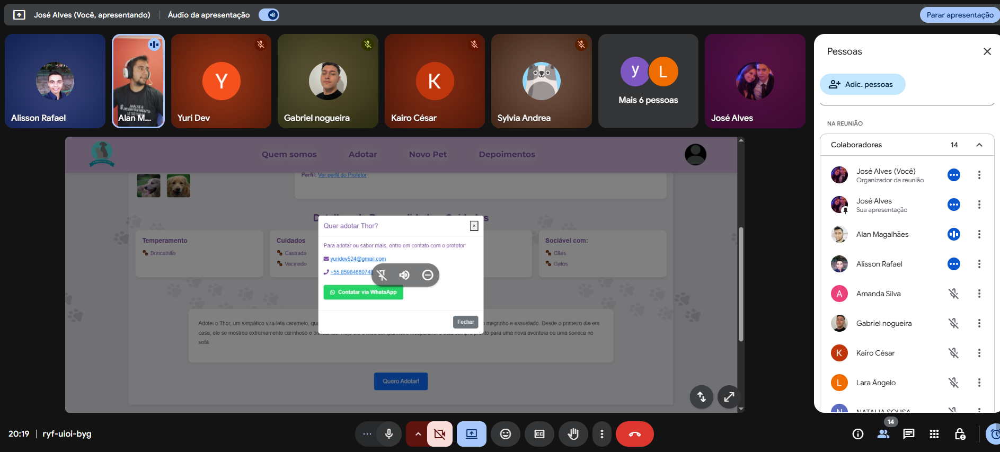
*Demonstração do modal com opções de contato, incluindo WhatsApp.*

**Telas de Gerenciamento do Usuário:**
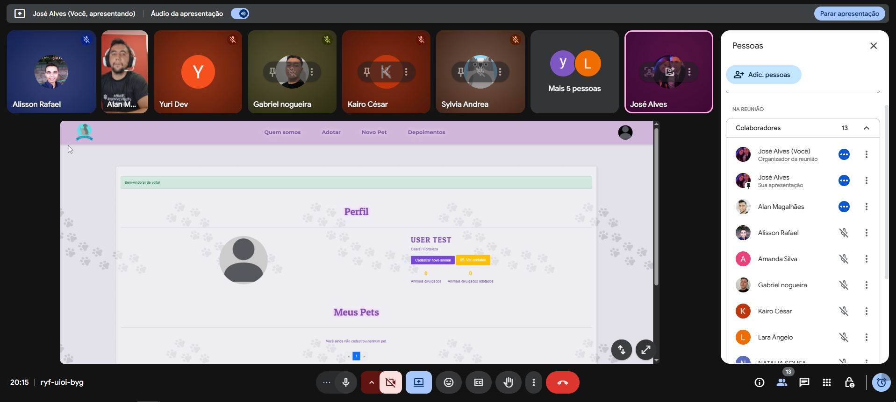
*Apresentação da página de perfil do protetor.*

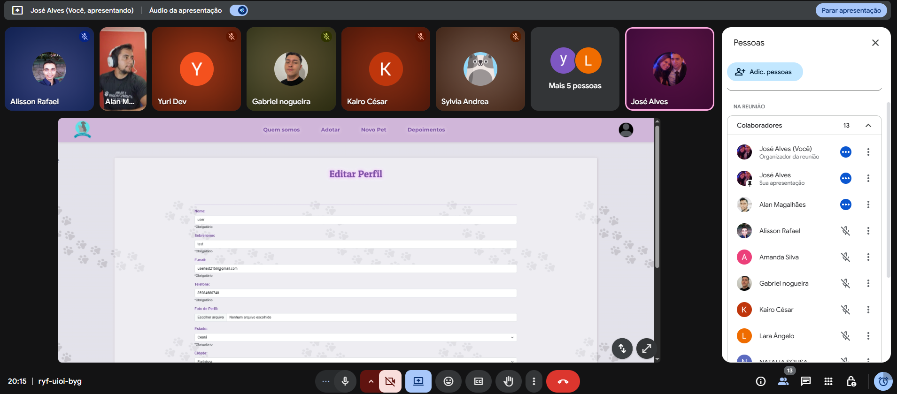
*Demonstração do formulário de edição de perfil.*

**Telas de Gerenciamento de Pets:**
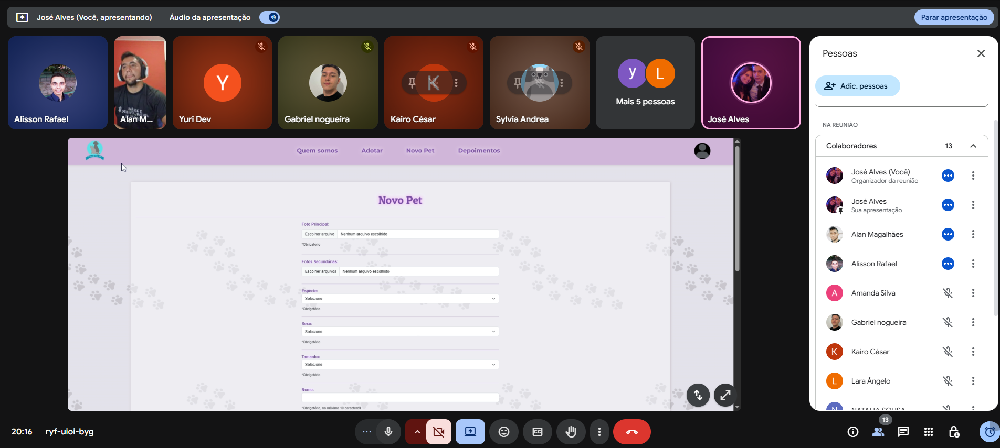
*Apresentação do formulário de cadastro de um novo animal (parte 1).*

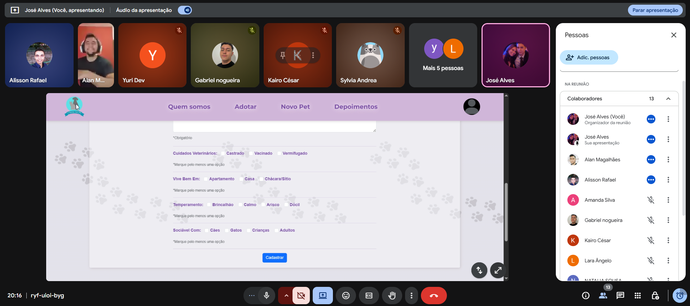
*Apresentação do formulário de cadastro de um novo animal (parte 2).*

**Telas de Depoimentos:**
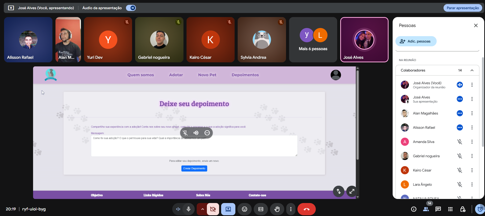
*Demonstração da funcionalidade de depoimentos.*

## 2. Feedback Coletado e Validação das Funcionalidades

Após a apresentação, foi enviado um formulário de feedback aos participantes para coletar suas impressões de forma estruturada. As respostas, em conjunto com os comentários feitos durante a reunião, formaram a base para a validação.

O formulário utilizado para a coleta dos dados pode ser acessado através do seguinte link:
**[Acessar Formulário de Feedback](https://docs.google.com/forms/d/e/1FAIpQLScDNI_jWJQUsYp7bdKRjDrJy_w8ZMXk6w1KV1M7CjtUFWMUTw/viewform)**

### Evidências do Feedback (Gráficos)

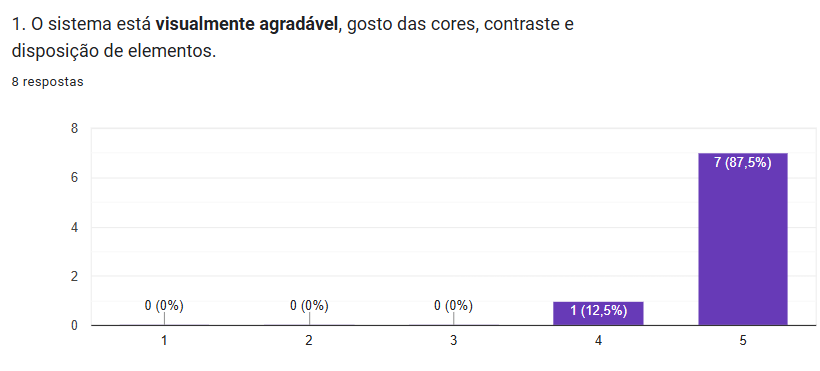
*1. O sistema está visualmente agradável?*

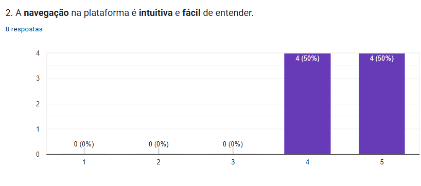
*2. A navegação na plataforma é intuitiva?*

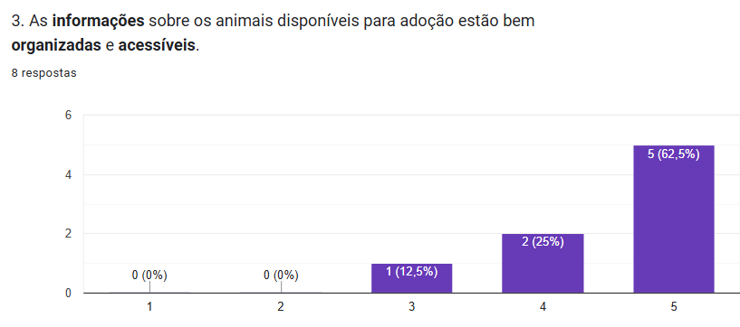
*3. As informações sobre os animais estão bem organizadas?*

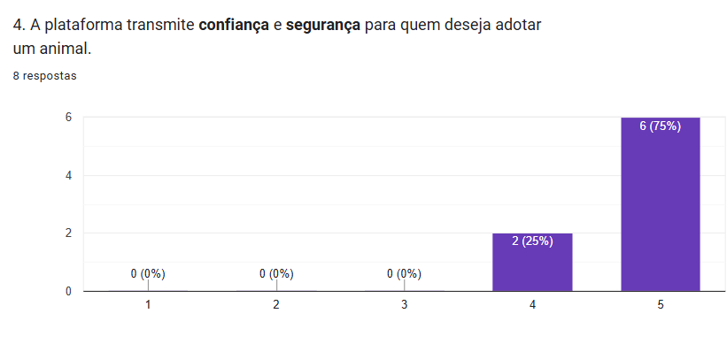
*4. A plataforma transmite confiança e segurança?*

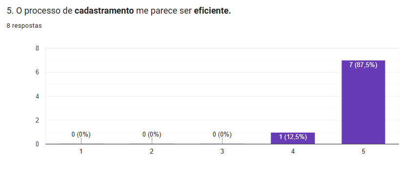
*5. O processo de cadastramento parece ser eficiente?*

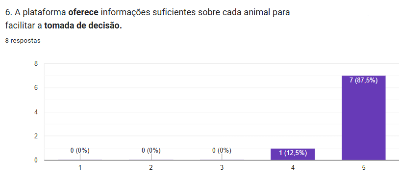
*6. A plataforma oferece informações suficientes sobre cada animal?*

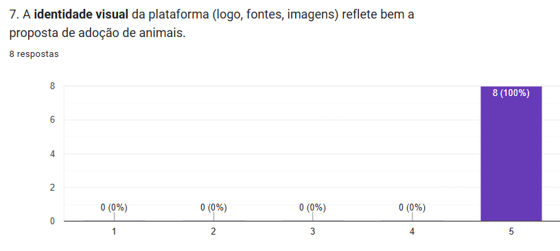
*7. A identidade visual reflete bem a proposta de adoção?*

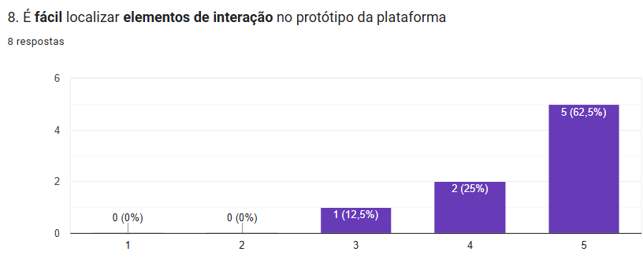
*8. É fácil localizar os elementos de interação?*

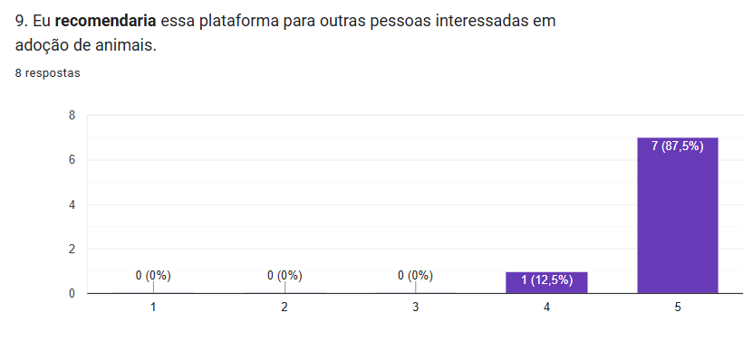
*9. Você recomendaria esta plataforma?*

### Principais Sugestões de Melhorias Recebidas

- **Sugestão 1: Sistema de Recomendação:** Durante a reunião, a participante Sylvia Andréa questionou: *“É possível ao ver o animal com suas informações, ter outros sendo sugeridos de acordo com o que estou vendo?”* A sugestão é criar uma funcionalidade de recomendação de pets semelhantes.

- **Sugestão 2: Simplificação do Cadastro de Pets:** Uma protetora comentou sobre a quantidade de campos no formulário: *“Acredito que quem tem muitos animais disponíveis, pode cansar ao preencher tantos dados.”*

- **Sugestão 3: Sistema de Avaliação Quantitativa:** Outra participante sugeriu um sistema complementar aos depoimentos: *“Vocês já pensaram em permitir que as pessoas deixem avaliações com estrelas ou curtidas...?”*

- **Comentários Adicionais do Formulário:**
  

## 3. Ajustes Implementados e Próximos Passos

Com base no feedback, a equipe definiu um quadro de ações:

| Sugestão dos Usuários | Justificativa | Ação do Grupo | Status |
| :--- | :--- | :--- | :--- |
| **Exibir recomendações de animais semelhantes** | Tornar a navegação mais dinâmica e aumentar as chances de um "match". | Implementação planejada para uma versão futura (v2.0). | **Planejado** |
| **Simplificar o cadastro de animais** | Reduzir o tempo de preenchimento para protetores com muitos animais. | O formulário foi revisado e mantido, pois os campos são considerados essenciais para o adotante. A sugestão foi anotada para futuras otimizações. | **Em Análise** |
| **Criar sistema de avaliação por estrelas/curtidas** | Aumentar a interação e a credibilidade social da plataforma. | Funcionalidade registrada como proposta para uma versão futura. | **Planejado** |

## 4. Resultados e Aprendizados Obtidos

A validação confirmou que a plataforma **A Friend for Life** é percebida como funcional, visualmente agradável e socialmente relevante. O feedback positivo (87,5% dos respondentes deram nota 5 para a aparência e recomendariam a plataforma) valida a direção do projeto.

Os principais aprendizados foram:
- A importância de simplificar fluxos para usuários que inserem grandes volumes de dados (protetores).
- O potencial de funcionalidades de engajamento (recomendações, avaliações) para aumentar a confiança e o tempo de uso da plataforma.
- A necessidade de estimular ativamente o feedback durante as sessões de validação para obter insights mais detalhados.

O processo confirmou que o produto atende às necessidades do público-alvo e forneceu um roteiro claro para futuras melhorias.